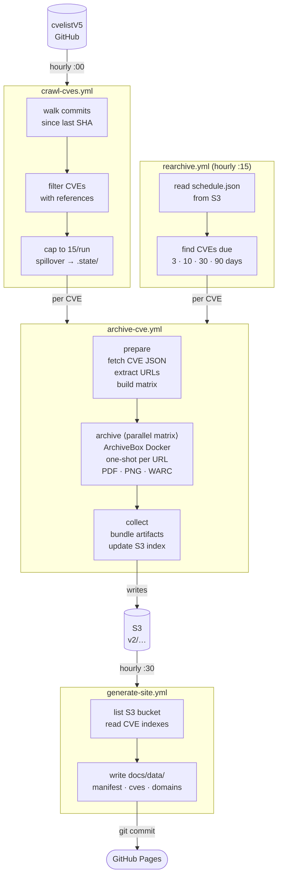

# refgha — CVE Reference Archiver

A GitHub Actions pipeline that monitors the [CVE List V5](https://github.com/CVEProject/cvelistV5) for new CVE publications, fetches every reference URL, and archives each one using ArchiveBox — producing a PDF, screenshot, and compressed WARC before the content disappears.

**Browse the archive:** [cve.davidwelch.co](https://cve.davidwelch.co)

---

## How It Works

### Architecture



### Job Flow

**`archive-cve.yml`** is the core unit. It runs three jobs in sequence:

1. **prepare** — Fetches the CVE JSON from `CVEProject/cvelistV5`, extracts reference URLs via `jq`, and emits a `fromJSON` matrix (one entry per URL).

2. **archive** — Parallel matrix job. Each runner pulls the `archivebox/archivebox` Docker image and archives a single URL (`add --depth=0`), then uploads three files to S3:
   - `output.pdf`
   - `screenshot.png`
   - `warc.tgz`

   S3 key pattern: `v2/<domain>/<path>[__q__<query>]/<timestamp>/`

3. **collect** — Downloads all per-reference artifacts, bundles them into a single per-CVE artifact, and writes a JSON index to `v2/index/<CVE-ID>.json` in S3.

**`crawl-cves.yml`** runs hourly. It walks the cvelistV5 commit log from the last-processed SHA, finds changed CVE files that have references, caps the batch to 15 CVEs, and triggers `archive-cve` for each. Overflow CVEs are written to `.state/spillover-cves.txt` and processed first next run.

**`rearchive.yml`** reads `v2/schedule.json` from S3 and re-archives any CVE whose next scheduled interval is due. Intervals: 3 days → 10 days → 30 days → 90 days.

**`generate-site.yml`** runs at :30 (after the :00 crawl). It lists the S3 bucket, reads all per-CVE index files, and generates the static site data files committed to `docs/data/`.

---

## Stats

Live stats at [cvearchiver.com/stats.html](https://cvearchiver.com/stats.html).

| Metric | Value |
|--------|-------|
| CVEs tracked | 4,407 |
| Unique domains archived | 999 |
| Unique URLs archived | 11,569 |
| Total snapshots (PDF/PNG/WARC sets) | 34,494 |
| Avg URLs per CVE | 2.6 |
| Avg snapshots per URL | 2.98 |

### Notes

- The archive spans from **CVE-1999-0073** through CVEs published the same day the crawl runs.
- Some CVE references point to `web.archive.org` — the archiver ends up archiving archives.
- Pipeline launched March 28, 2026; automated commits from `github-actions[bot]` accumulate with every crawl and site regeneration cycle.

---

## Workflows

| Workflow | Trigger | Purpose |
|----------|---------|---------|
| `archive-cve.yml` | manual / `workflow_call` | Archive all references for a single CVE |
| `batch-archive.yml` | manual | Archive a list of CVEs (newline or comma separated) |
| `crawl-cves.yml` | hourly `:00` | Discover and archive newly published CVEs |
| `rearchive.yml` | hourly `:15` | Re-archive CVEs on 3/10/30/90 day schedule |
| `generate-site.yml` | hourly `:30` | Regenerate static site data from S3 |

### Manual Archival

**Single CVE:**
```
Actions → archive-cve → Run workflow → cve_id: CVE-2021-44228
```

**Batch:**
```
Actions → batch-archive → Run workflow → cve_ids:
CVE-2021-44228
CVE-2022-0001
CVE-2023-1234
```

---

## Local Development

Requires [nektos/act](https://github.com/nektos/act):

```bash
brew install act

# Test the prepare job (no Docker-in-Docker needed)
act workflow_dispatch \
  -W .github/workflows/archive-cve.yml \
  --input cve_id=CVE-2025-29002 \
  -j prepare
```

Full end-to-end archival (archive + collect jobs) doesn't work locally due to Docker-in-Docker limitations on macOS. Test those on actual GitHub Actions runners.

---

## Storage Layout

```
S3: archiver-demo-v1-public/
└── v2/
    ├── <domain>/<path>/<timestamp>/
    │   ├── output.pdf
    │   ├── screenshot.png
    │   └── warc.tgz
    ├── index/
    │   └── <CVE-ID>.json       # per-CVE reference index
    ├── index.json              # global URL index
    └── schedule.json           # re-archive schedule

GitHub Pages (docs/):
└── data/
    ├── manifest.json           # global stats
    ├── cves/<CVE-ID>.json      # 345 files
    └── domains/<domain>.json   # 126 files
```

---

## Stack

| Component | Technology |
|-----------|-----------|
| Orchestration | GitHub Actions (ubuntu-latest) |
| CVE data source | CVEProject/cvelistV5 (GitHub raw) |
| Archiving | ArchiveBox Docker (one-shot per URL) |
| Scripting | Bash + `jq` + `curl` |
| Site generation | Python 3 |
| Storage | AWS S3 + GitHub Pages |
| Local testing | nektos/act |
