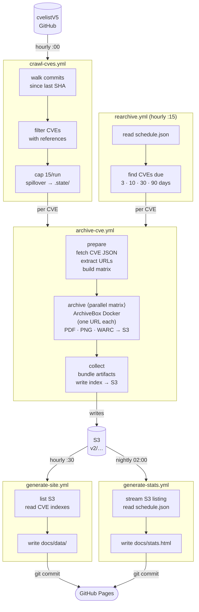

# refgha — CVE Reference Archiver

Monitors [CVEProject/cvelistV5](https://github.com/CVEProject/cvelistV5) for new CVEs, archives every reference URL with ArchiveBox (PDF + screenshot + WARC), and serves a static browse/search UI.

**Browse:** [cvearchiver.com](https://cvearchiver.com) · **Stats:** [https://cvearchiver.com/stats.html](https://cvearchiver.com/stats.html)

---

## Architecture



---

## Storage

```
S3: archiver-demo-v1-public/v2/
├── <domain>/<path>/<YYYYMMDD-HHMMSS>/
│   ├── output.pdf
│   ├── screenshot.png
│   └── warc.tgz
├── index/<CVE-ID>.json     # per-CVE reference list + snapshot URLs
├── index.json              # global URL index
└── schedule.json           # re-archive ledger (first_archived, completed_intervals)

GitHub Pages: docs/
├── index.html              # SPA — browse by domain or CVE
├── stats.html              # charts (nightly, generated from S3)
└── data/
    ├── manifest.json
    ├── cves/<CVE-ID>.json
    └── domains/<domain>.json
```

---

## Workflows

| Workflow             | Trigger                  | Purpose                               |
| -------------------- | ------------------------ | ------------------------------------- |
| `archive-cve.yml`    | manual / `workflow_call` | Archive all refs for one CVE          |
| `batch-archive.yml`  | manual                   | Archive a list of CVEs                |
| `crawl-cves.yml`     | hourly `:00`             | Discover and queue new CVEs           |
| `rearchive.yml`      | hourly `:15`             | Re-archive on 3/10/30/90-day schedule |
| `generate-site.yml`  | hourly `:30`             | Rebuild static site data from S3      |
| `generate-stats.yml` | nightly `02:00`          | Rebuild stats page from S3            |

**Manual trigger — single CVE:**

```
Actions → archive-cve → Run workflow → cve_id: CVE-2021-44228
```

**Manual trigger — batch:**

```
Actions → batch-archive → Run workflow → cve_ids:
CVE-2021-44228
CVE-2022-0001
```

---

## Stack

| Layer         | Tech                                        |
| ------------- | ------------------------------------------- |
| Orchestration | GitHub Actions (ubuntu-latest)              |
| CVE source    | CVEProject/cvelistV5 via GitHub raw         |
| Archiving     | ArchiveBox Docker, one-shot per URL         |
| Scripting     | Bash + `jq` + `curl`                        |
| Site gen      | Python 3 + Chart.js                         |
| Storage       | AWS S3 + GitHub Pages                       |
| Local dev     | [nektos/act](https://github.com/nektos/act) |
